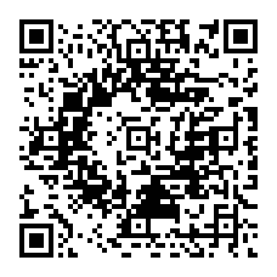
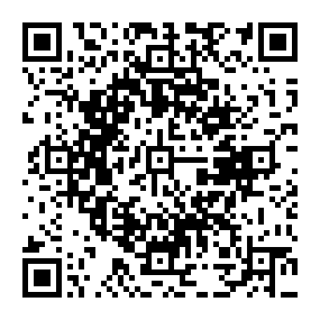
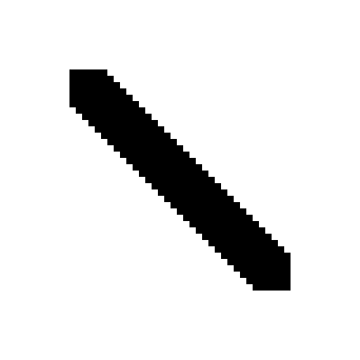
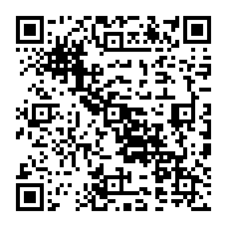
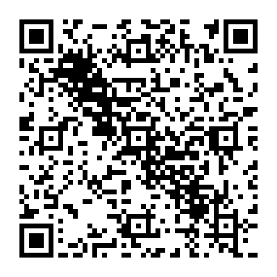
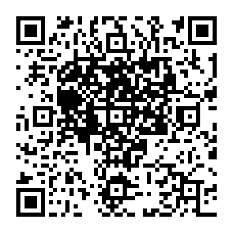
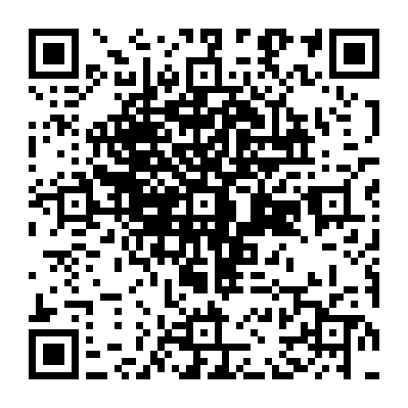

# 精度比較

このページは以前のByte方式に対する追加探索の測定記録です。現在の推奨設定については[数字用符号化の比較](./numeric/README.md)を参照してください。

旧コミット `79b4ce97f8a726b5a4b173cee8f93cb45b41ba85` の貪欲法・乱数生成・残存自由度サンプリングを、`tools/image-qr/legacy-greedy.cjs` に再実装しました。QR写像とGF(2)求解は新エンジンと共通です。旧アプリ全体を実行した比較ではありません。

条件はVersion 8、ECC M、固定部分 `https://example.com/#`、URL-safe可変部分128文字、8マスク、3パス、残す自由度8、サンプル64、seed 7。目標はコードで定義した3図形、重要度は全マス1、絶対指定なし、濃淡の評価割合0です。旧版側の自動制限は無効とし、新版側は残存自由度の全列挙・局所改善を追加、探索時間の目安20秒としています。

## 測定結果

| 目標 | 旧貪欲法の画素一致 | 完成版の画素一致 | 差（ポイント） | 旧／完成版の秒数 | 画像からの復号 |
| --- | ---: | ---: | ---: | ---: | --- |
| 円形 | 64.35% | 64.60% | +0.25 | 1.30 / 18.03 | 両方成功 |
| 斜線 | 64.39% | 65.06% | +0.67 | 1.21 / 19.71 | 両方成功 |
| ハート | 64.22% | 64.31% | +0.08 | 1.07 / 18.14 | 両方成功 |

追加探索を含むので、同じ実行時間・評価回数での比較ではありません。改善幅は小さく、別の図柄で同様の改善を保証しません。時間制限に到達する環境では結果も変わり得ます。3例とも固定バイト・許可文字・独立エンコーダとの一致・RS検証を通過しています。読取対象のURLは動作確認用です。

このほか、回帰テストでは、旧アフィン集合0〜7に入らない数字8を必要とする目標を、許可集合0〜9から探索し完全一致で回収できることを確認しています。これは構成した小さな問題で、一般画像の一致率を示すものではありません。

## 検証画像

左から目標・旧貪欲法・完成版。余白と1マス8pxの寸法は共通です。

| 目標 | 旧貪欲法 | 完成版 |
| --- | --- | --- |
|  |  |  |
|  |  |  |
|  |  |  |

[生の結果と設定](benchmark.json)。再測定は `npm --prefix tools/image-qr run benchmark`。PNG・SVGとJSONは再生成されます。この表は記録時の数値です。
