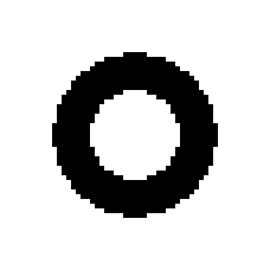
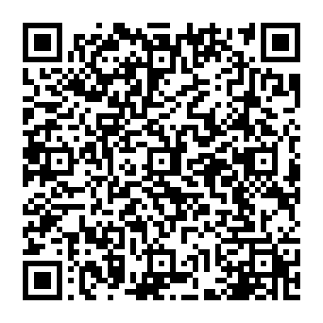
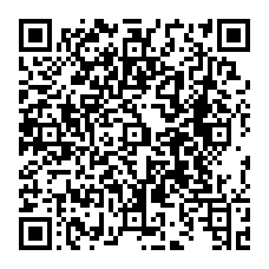
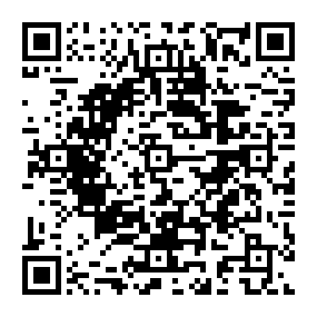
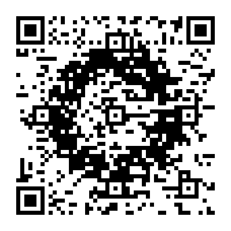

# 正規版と加工版の比較

各組の正規版と加工版で、読み取れる文字列の全バイト・49×49マス・誤り訂正M・マスク・向き・白い余白は同じです。数字への置き換えや可変部分の延長は行っていません。正規版の生成後、訂正能力の一部を使ってマスを目標へ近づけます。

目標はコードで定義した円形、重要度は全マス1、絶対指定なし。正規版の生成はByte方式・8マスク比較・20秒の予算、加工の上限は各RSブロックの訂正可能語数の70%です。時間制限のため、正規版の探索結果は実行環境により変わり得ます。

| 入力 | 正規版の画素一致 | 加工版の画素一致 | 差 | 変更量 | 画像からの復号 |
| --- | ---: | ---: | ---: | --- | --- |
| 全体を固定したURL | 49.35% | 56.60% | +7.25ポイント | 174マス・28語 | 元のURLと一致 |
| 固定URL＋可変ASCII 128文字 | 64.68% | 70.51% | +5.83ポイント | 140マス・28語 | 正規版の全文字列と一致 |

固定URLの例は `https://example.com/qr-art?theme=green#demo`。可変ありの例は固定部分 `https://example.com/#` とURL-safe可変部分128文字です。両例の正規版を同じ条件とみなして比較する表ではなく、それぞれの正規版から加工版への変化を示しています。

このVersion／ECCでは4ブロックあり、1ブロックの理論上の訂正能力は11語です。各ブロック7語を加工し、4語分の余力を残しました。位置検出・位置合わせ・形式情報などの構造は変更していません。

両方の加工版を、1マス2／4／8px・余白4マスで独立デコーダjsQRに入力し、元と完全に同じバイト列に復号できました。これは生成画像の検証で、実機カメラ・印刷・汚れ・遠近変形などの読み取り保証ではありません。加工した分だけ外部の損傷に使える訂正余力は減ります。

| 入力 | 正規版 | 加工版 |
| --- | --- | --- |
| 全体を固定したURL |  |  |
| 固定URL＋可変ASCII |  |  |

[生の結果・設定・ブロック別検証](benchmark.json)。再測定は `npm --prefix tools/image-qr run benchmark:artistic`。PNG・SVGとJSONが再生成されます。この表は記録時の数値です。
