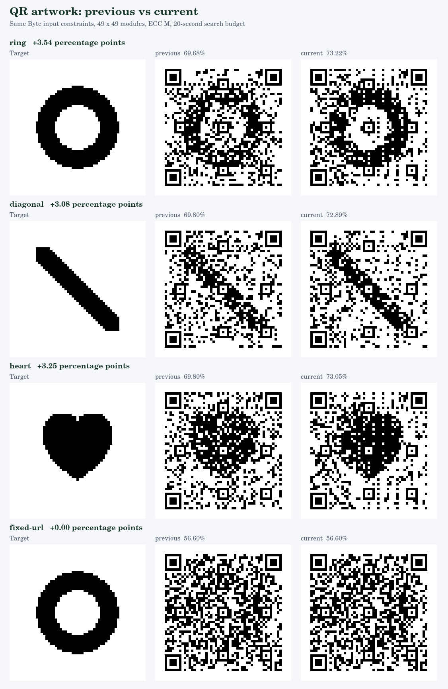

# 完成画像を基準にした探索の比較

以前のコミット `36be09c07c8ee9bc15be178f51f65fb452aa6d6b` と改善版の、生成から加工・検証・候補選択までの処理を比較しました。加工前の候補だけを評価せず、検証を通った完成画像で選ぶことと、Byteの自動初期集合を画像に合わせることを変更しています。

同じ49×49マス、ECC M、Byte方式、8マスク、seed 1、正規版の探索予算20秒、訂正能力の70%を上限とした加工です。可変部分のある3図柄は、固定部分 `https://example.com/#` とURL-safe文字128文字を共通にしています。全体を固定したURLの例は `https://example.com/qr-art?theme=green#demo` です。数字列への置き換えや、文字数・QRサイズ・訂正予算の変更はありません。

| 目標 | 以前の完成画像の画素一致 | 改善版の完成画像の画素一致 | 差 | 以前 / 改善版の処理秒数 |
| --- | ---: | ---: | ---: | ---: |
| 円形 | 69.68% | 73.22% | +3.54ポイント | 20.20 / 16.67 |
| 斜線 | 69.80% | 72.89% | +3.08ポイント | 20.13 / 18.12 |
| ハート | 69.80% | 73.05% | +3.25ポイント | 20.14 / 19.41 |
| 全体を固定したURL・円形 | 56.60% | 56.60% | 0.00ポイント | 0.51 / 0.58 |

これは生成した図形・重要度1・絶対指定なしの比較です。探索後の検証時間も処理秒数に含みます。各条件の処理は順に実行しました。時間制限に基づく探索なので、環境により候補と数値が変わります。図形以外の写真・人物・文字など任意画像の一般的な品質を示す結果ではなく、全体最適解の保証もありません。

可変部分の文字列とマスクは探索の結果で、以前と改善版で異なる場合があります。両版が完全に同じURLへ復号される比較ではありません。それぞれが、共通の固定部分・許可文字・128文字という条件を満たします。全体を固定したURLの行では、その全文字列が同一です。

すべての正規版を独立エンコーダ・画像からの復号・RS誤り0で検証しました。すべての加工版は、構造の保持、各ブロックの訂正予算、1マス2 / 4 / 8pxで正規版と同じ全文字列への復号を確認しています。詳細は[設定・実測値・検証結果](benchmark.json)に保存しています。

再実行は `npm --prefix tools/image-qr run benchmark:completion`。個別のPNG/SVGとJSONを更新します。表と比較図は記録時の結果です。以前のソースは上記コミットを `git show` で読み込むため、そのコミットを含むGit履歴が必要です。Node.js 24を使用しています。

## 実際のブラウザでの確認

Chromium 153.0.8010.0で、単一HTMLを通信なしで開いて確認しました。

- PNG画像をファイル入力から読み込み、ネイティブCanvasで変換。
- 実際のBlob Workerで探索・検証し、中断後も同じ入力で再生成。
- 保存ボタンから正規版・加工版PNGと加工版SVGをダウンロード。
- 保存PNGをNode側のjsQRで復号し、SVGもブラウザでラスタライズして全文字列を復号。
- 1280pxと390pxの画面幅で、横はみ出し・未処理例外・外部通信なし。

再実行は `npm --prefix tools/image-qr run test:browser`。このブラウザテストをCIにも追加しました。機種の実際のカメラ、紙への印刷、汚れや遠近変形による読み取りは別の評価です。
