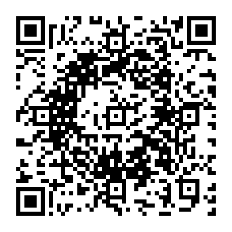
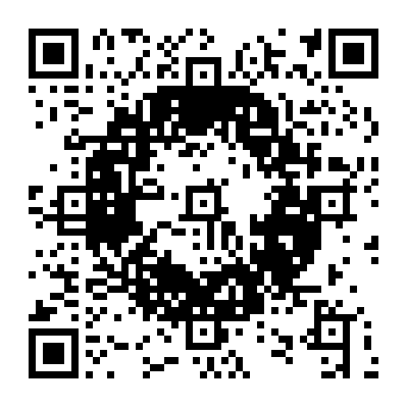
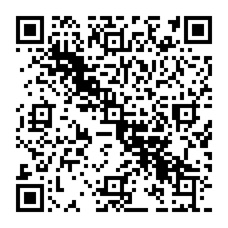
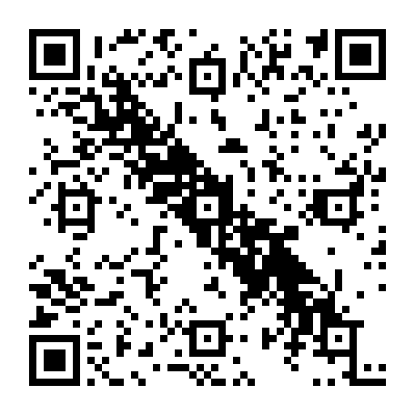
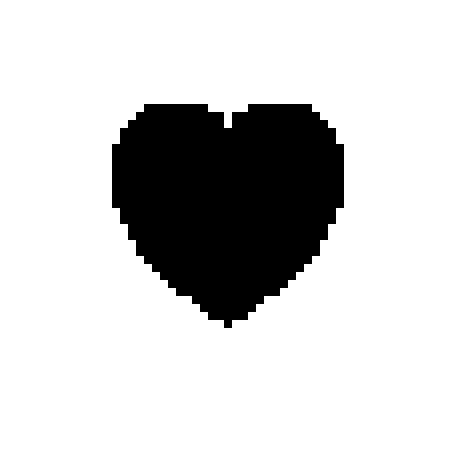
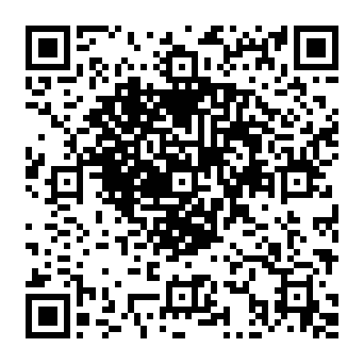
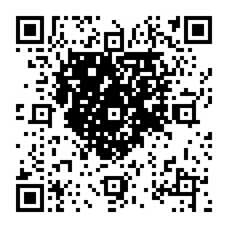

# 数字用符号化による比較

同じ49×49マス（Version 8）、誤り訂正M、固定URL `https://example.com/#` を保って、Byte方式とNumeric方式を比較しました。両方とも現在の探索エンジンを使用しています。

容量を使い切る設定なので、可変部分の長さはByteが131文字、Numericが311桁です。使用可能文字は共通のURL-safe集合で、Numeric方式はそこから数字0〜9を使用します。文字数を同じにした比較ではありません。固定URLの後ろに使える容量の活用を比較しています。

探索予算はそれぞれ20秒、マスク8通り、3パス、残す自由度8、サンプル64、seed 1、濃淡の評価割合0.35。目標はコードで定義した3図形、重要度は全マス1、絶対指定はありません。

| 目標 | Byteの画素一致 | Numericの画素一致 | 改善（ポイント） | 黒領域の再現 Byte → Numeric | 背景への黒混入 Byte → Numeric |
| --- | ---: | ---: | ---: | ---: | ---: |
| 円形 | 65.26% | 72.84% | +7.58 | 67.99% → 78.81% | 35.76% → 29.40% |
| 斜線 | 64.81% | 71.80% | +7.00 | 65.92% → 74.08% | 35.39% → 28.59% |
| ハート | 64.89% | 72.05% | +7.16 | 69.42% → 78.02% | 36.64% → 29.96% |

黒領域の再現は高いほど、背景への黒混入は低いほど目標に近くなります。画素一致と探索スコアは別の指標で、ここでは画素一致を掲載しています。表の結果は1回の測定値で、端末の速度や時間制限により候補と数値は変わり得ます。

6候補すべて、固定文字列・許可文字・独立エンコーダとの白黒差分0・RS誤り0・画像からの独立復号を確認しました。誤り訂正を絵のために消費せず、有効なQRコードの文字列を探索しています。実機カメラでの読み取りや、任意の絵で同じ改善幅になることを保証する比較ではありません。

| 目標 | Byte | Numeric |
| --- | --- | --- |
|  |  |  |
|  |  |  |
|  |  |  |

[生の結果と設定](benchmark.json)。再測定は `npm --prefix tools/image-qr run benchmark:numeric`。PNG・SVGとJSONは再生成されます。この表は記録時の数値です。
