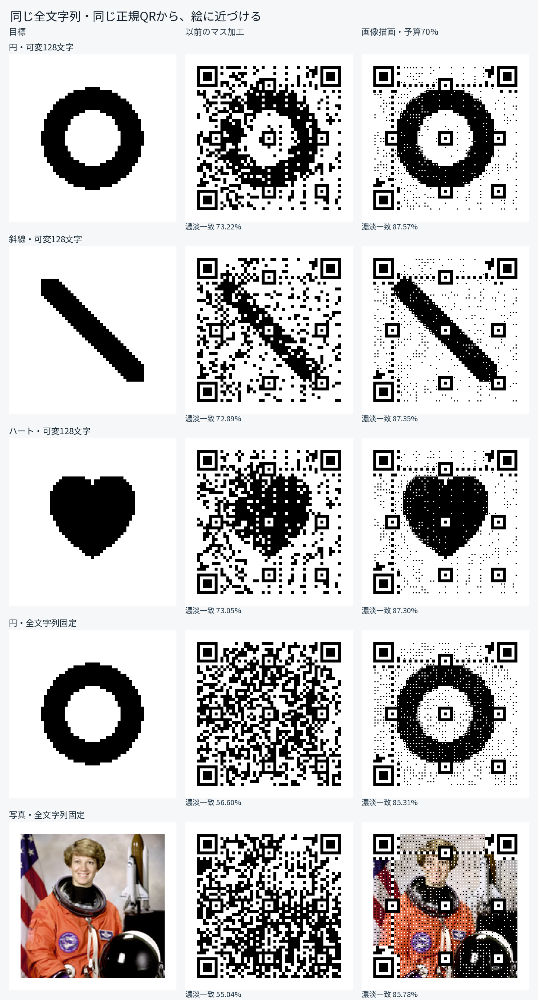

# 画像描画モードの比較

同じ正規QR・全文字列・Version・ECC・Mask・向きから、以前のマス加工と新しい画像描画を比較しました。文字列を変えたことによる改善を含みません。



| 目標 | 以前のマス加工 | 画像描画・予算70% | 差 |
| --- | ---: | ---: | ---: |
| 円・可変128文字 | 73.22% | 87.57% | +14.35ポイント |
| 斜線・可変128文字 | 72.89% | 87.35% | +14.46ポイント |
| ハート・可変128文字 | 73.05% | 87.30% | +14.25ポイント |
| 円・全文字列を固定 | 56.60% | 85.31% | +28.71ポイント |
| 写真・全文字列を固定 | 55.04% | 85.78% | +30.74ポイント |

指標は、余白を除いた完成画像と目標画像の明るさの平均絶対差を255で正規化し、1から引いた**濃淡一致**です。1マス8pxで、位置検出・位置合わせなどの構造も含めて測定しています。二値の図形では画素一致と同じになります。写真は147×147pxの元画像を比較対象とし、二値化した写真との比較ではありません。中央のマスの一致率とは別に記録しています。人の見た目の評価や任意の写真の再現率を示す数値ではありません。

## 条件

- Node.js 24、49×49マス（Version 8）、ECC M、Byte、向き0°、マスク8通り、予算70%、濃淡評価割合0.35。
- 以前のエンジンは [`af92ce2`](https://github.com/SnowFairyTea/playground/commit/af92ce2c76e791776a67a253f40d95b2d94b8e8a)。20秒の正規QR探索と完成画像による選択で、マス加工版を生成します。
- 新しい加工には、以前の選択と**同じ正規QRの行列・全文字列**を渡します。マス加工＋画像描画と、中央を変更しない画像描画を試し、復号を通る完成画像を比較します。今回の5例は色を残すモード・中央幅37.5%を採用しました。
- 可変部分の3例は、固定部分 `https://example.com/#` とURL-safe文字128文字。各比較の前後で、実際の可変文字列も完全に同じです。
- 円と写真の固定URLは、全文が `https://example.com/qr-art?theme=green#demo`。
- どの出力も保存用の8px画像から同じ全文字列へ復号できることを確認しました。新しい画像描画は4／8／12px、8px画像の面積平均50%縮小、3×3ぼかしでも同じバイト列へ復号します。
- 構造・余りビット・絶対指定・重要度0はマス全体を保持。RSブロックごとの中央マスの誤り語数は予算以内で、少なくとも1語分の余力を残します。周囲の画像による読み取りへの影響は画像復号で確認します。

## 誤り訂正の予算

`benchmark.json` の `budgets` に、同じ正規QRから0%／50%／70%／90%で作った画像の濃淡一致、中央の誤り語数、RSブロックの実測を記録しています。0%でも中央のマスを変更せず画像を描けます。予算を増やすと中央も絵に合わせられますが、検出結果によって採用する描画や残す語数が変わります。

## ブラウザと保存

`browser.json` は通信を切った実際のChromiumの記録です。1280px／390px幅で色付き図形、1280px幅で写真を入力し、ネイティブCanvas・Worker・PNG/SVG保存を確認しました。実際に保存したPNGと、ブラウザでラスタライズしたSVGは**全画素が一致**し、どちらも同じ文字列へ復号できました。0%予算の白黒画像、中断後の再生成、横はみ出し・例外・外部通信の不在も確認しています。

- `*-regular.png`：同一比較の元の正規QR。
- `*-previous.png`：以前のマス加工。
- `*-current.png` / `*-current.svg`：新しい画像描画。
- `*-target.png`：図形の目標。
- `astronaut-source.png`：写真の147×147px入力。`astronaut-qr-target.png` はQR探索用の49×49px入力。
- `comparison.png` / `photo-comparison.png`：記録した出力を並べた比較図。表示用に拡縮されるため、読み取りには個別の出力ファイルを使ってください。
- `benchmark.json`：指標・全文字列・訂正予算・復号結果の実測。

写真はscikit-imageの [`astronaut`](https://scikit-image.org/docs/stable/api/skimage.data.html#skimage.data.astronaut) に含まれるNASAのEileen Collinsの写真を使用しました。公式説明ではパブリックドメインです。入力の配布元は[scikit-image v0.24.0](https://raw.githubusercontent.com/scikit-image/scikit-image/v0.24.0/skimage/data/astronaut.png)。ここでは色を保持し、Lanczosで147px／49pxへ縮小しています。

```sh
npm ci --prefix tools/image-qr --ignore-scripts
npm --prefix tools/image-qr run benchmark:picture
npm --prefix tools/image-qr test
tools/image-qr/node_modules/.bin/playwright install --with-deps chromium
npm --prefix tools/image-qr run test:browser
```

比較図と表は記録した実行の結果です。探索は時間制限付きで、環境によって結果が変わることがあります。5例での検証であり、実機カメラ・印刷・汚れ・遠近変形・多様な写真を網羅した保証ではありません。
